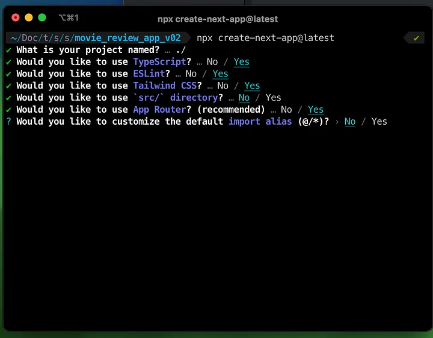
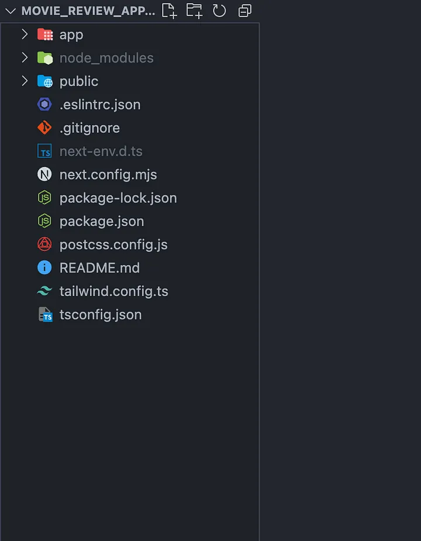
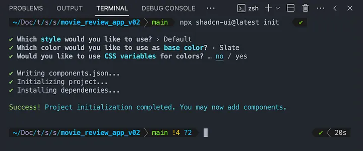

# SolanaWalletUIUX

Step 1: Set up next.js application with tailwind css

```
npx create-next-app@latest
```

<figure><figcaption><p>Nextjs initial setup<br></p></figcaption></figure>


<figure><figcaption><p>Initial File Structure:</p></figcaption></figure>


Set up Now lets setup [shadcn](https://ui.shadcn.com/docs/installation/next) , Shadcn provides reusable components that compatible with tailwind css . Its a open source project.

#### Run the CLI <a href="#run-the-cli" id="run-the-cli"></a>

Run the `shadcn-ui` init command to setup your project:

```
npx shadcn-ui@latest init
```

#### Configure components.json <a href="#configure-componentsjson" id="configure-componentsjson"></a>

You will be asked a few questions to configure `components.json`:

```
Which style would you like to use? › DefaultWhich color would you like to use as base color? › SlateDo you want to use CSS variables for colors? › no / yes
```

Copy

#### Fonts <a href="#fonts" id="fonts"></a>

I use [Inter](https://rsms.me/inter/) as the default font. Inter is not required. You can replace it with any other font.

Here's how I configure Inter for Next.js:

**1. Import the font in the root layout:**

```
import "@/styles/globals.css"import { Inter as FontSans } from "next/font/google" import { cn } from "@/lib/utils" const fontSans = FontSans({  subsets: ["latin"],  variable: "--font-sans",}) export default function RootLayout({ children }: RootLayoutProps) {  return (    <html lang="en" suppressHydrationWarning>      <head />      <body        className={cn(          "min-h-screen bg-background font-sans antialiased",          fontSans.variable        )}      >        ...      </body>    </html>  )}
```

Copy

**2. Configure `theme.extend.fontFamily` in `tailwind.config.js`**

```
const { fontFamily } = require("tailwindcss/defaultTheme") /** @type {import('tailwindcss').Config} */module.exports = {  darkMode: ["class"],  content: ["app/**/*.{ts,tsx}", "components/**/*.{ts,tsx}"],  theme: {    extend: {      fontFamily: {        sans: ["var(--font-sans)", ...fontFamily.sans],      },    },  },}
```

Copy

#### App structure <a href="#app-structure" id="app-structure"></a>

Here's how I structure my Next.js apps. You can use this as a reference:

```
.├── app│   ├── layout.tsx│   └── page.tsx├── components│   ├── ui│   │   ├── alert-dialog.tsx│   │   ├── button.tsx│   │   ├── dropdown-menu.tsx│   │   └── ...│   ├── main-nav.tsx│   ├── page-header.tsx│   └── ...├── lib│   └── utils.ts├── styles│   └── globals.css├── next.config.js├── package.json├── postcss.config.js├── tailwind.config.js└── tsconfig.json
```

Copy

* I place the UI components in the `components/ui` folder.
* The rest of the components such as `<PageHeader />` and `<MainNav />` are placed in the `components` folder.
* The `lib` folder contains all the utility functions. I have a `utils.ts` where I define the `cn` helper.
* The `styles` folder contains the global CSS.

#### That's it <a href="#thats-it" id="thats-it"></a>

You can now start adding components to your project.

```
npx shadcn-ui@latest add button
```

Copy

The command above will add the `Button` component to your project. You can then import it like this:

```
import { Button } from "@/components/ui/button" export default function Home() {  return (    <div>      <Button>Click me</Button>    </div>  )}
```

run

```
npx shadcn-ui@latest init
```


<figure><figcaption><p>shadcn installing</p></figcaption></figure>

### lets install npm libraries that will help us to create the wallet connector . <a href="#id-4080" id="id-4080"></a>

```
npm i @solana/wallet-adapter-react @solana/wallet-adapter-react-ui @solana/web3.js  @solana/wallet-adapter-wallets @solana/wallet-adapter-base
```

at last lets add shadcn Dialog component .

```
npx shadcn-ui@latest add dialog
```

First lets create wallet connect context provider and wrap the enitre app.

\
